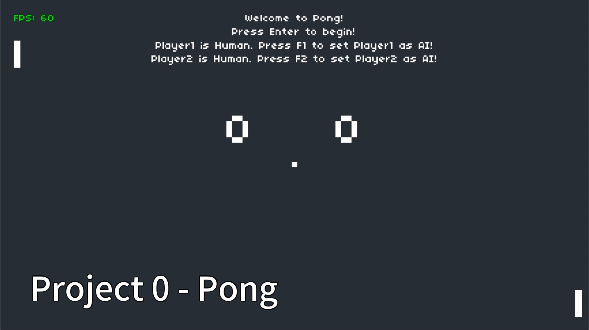

# Project 0 - Pong

## Video demo

## Content

- [v1.2] Paddle AI behaves more like human, will only start to move when it's turn to catch the ball.
- [v1.1] Paddle AI catches the ball with its main body of the paddle.  
- [v1.0] Basic AI to support one player game or two AIs game.
